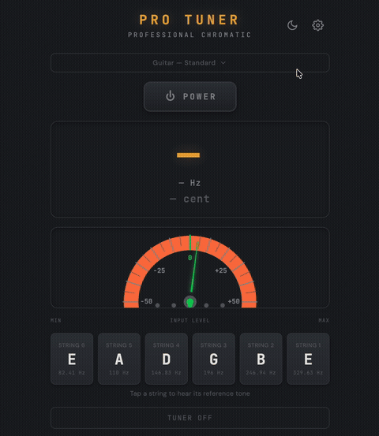

# Pro Tuner

Professional chromatic instrument tuner — runs in the browser, works offline.

**[tuner.schoensgibl.com](https://tuner.schoensgibl.com)**



---

## Features

- **YIN pitch detection** — accurate to ±0.5 cent across 50–2000 Hz
- **Needle meter** — spring-physics animated needle with LED indicators
- **Multi-instrument** — Guitar (11 tunings), Bass, Ukulele, Violin, Viola, Banjo, Chromatic
- **Smart string matching** — cents calculated against nearest string; falls back to chromatic for notes outside any string's range (>50 cent)
- **Collapsible selector** — instrument & tuning picker folds away to keep focus on the meter
- **Reference tones** — tap any string card to hear it
- **Quick-tune lock** — double-tap a string to lock the detector to it
- **A4 reference** — adjustable 430–450 Hz
- **Sharp / flat notation**, transposition support
- **PWA** — installable, works fully offline, Wake Lock keeps screen on while tuning
- **Dark mode by default**, light mode toggle

## Stack

Vanilla HTML + CSS + JS — no framework, no build step, no dependencies. Total bundle < 150 KB.

| File | Purpose |
|------|---------|
| `index.html` | App shell & all DOM |
| `css/style.css` | Styles, CSS custom properties, dark/light theming |
| `js/app.js` | Main wiring — audio engine → UI |
| `js/audio/audio-worklet-processor.js` | AudioWorklet YIN detector (audio thread) |
| `js/audio/pitch-detector.js` | YIN fallback for older browsers |
| `js/audio/noise-gate.js` | RMS noise gate — low/medium/high presets, 150ms hold-open, auto-calibration |
| `js/audio/tone-generator.js` | Reference tone playback |
| `js/tunings/tuning-data.js` | All instrument tunings, A4 recalculation |
| `js/ui/meter.js` | Canvas needle meter with spring physics |
| `js/ui/string-display.js` | String cards, click/double-click/long-press |
| `js/ui/theme.js` | Dark/light theme manager |
| `js/utils/settings.js` | Settings panel, localStorage persistence |
| `sw.js` | Service worker (cache-first PWA) |

## Audio Pipeline

1. `getUserMedia` — echo cancellation, AGC and noise suppression **disabled**
2. **AudioWorklet** runs YIN detection on the audio thread (falls back to ScriptProcessor)
3. YIN steps: difference function → cumulative mean normalized difference → absolute threshold (0.11) → parabolic interpolation
4. **Sub-octave validation** — after finding the first CMNDF valley, checks lag×2 for a fundamental an octave below; prefers it when CMNDF < threshold×2.5 (fixes harmonic confusion on low strings like E2/A2)
5. Adaptive buffer: 8192 samples below 200 Hz (low strings), 4096 above
6. DC offset removal before each analysis window
7. **Onset detection** — RMS jump >3× resets median filter and EMA for instant response to new notes
8. Median filter (ring buffer of 5 in worklet, 9 in fallback) removes outliers
9. **Proximity-aware EMA smoothing** — doubles alpha within 10¢ for faster lock-in; snaps immediately at >100¢ (note change); confidence-weighted base alpha
10. Harmonic correction: ×2/÷2 octave jumps corrected against smoothed reference frequency
11. Confidence filter: frames below 0.25 confidence discarded
12. Noise gate with 150ms hold-open (sustain dropout prevention) and auto noise floor calibration on start (p75 × 2.5); presets: low 0.001 / medium 0.004 / high 0.015
13. In-tune LED hysteresis: enters at < 5¢, exits at ≥ 8¢
14. Results throttled to ~60 fps for UI updates

## Local Development

```bash
cd pro-tuner
python3 -m http.server 8080
# open http://localhost:8080
```

Microphone access requires HTTPS or localhost — `file://` won't work.

## Deployment

```bash
git push origin main
ssh jarvis@94.130.37.43 "cd /home/jarvis/apps/pro-tuner && git pull origin main"
```

Nginx serves the directory directly with `Permissions-Policy: microphone=(self)`.

## License

MIT — © Lukas Schönsgibl
